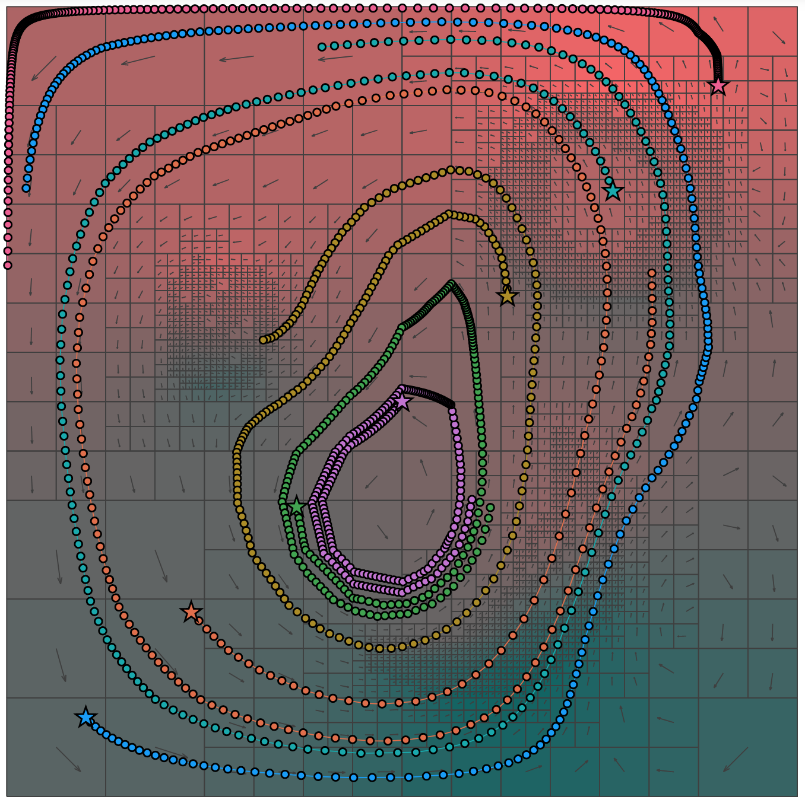

# Experimental Tool for PRiSM

## Quickstart

1. Install Jupyter. The easiest way is to install [Anaconda](https://anaconda.com), but if you already work with Python, you can [install it with `pip`, `conda`, etc.](https://jupyter.org/install)

2. Install Julia by following [these instructions](https://julialang.org/downloads/).

3. Install IJulia by running the Julia program you just downloaded, then

    - type `]` (closing bracket)
    - then enter `add IJulia`
    - To exit, type backspace and then enter `exit()`

4. Run Jupyter.

    - Open a terminal program (OS X: run the `Terminal` app)
    - Navigate to this directory (OS X: type `cd `(with the space), then drag this directory into the terminal and enter)
    - Enter `jupyter notebook`
    - If your browser doesn't open automatically, copy the URL into your web browser. It will look something like

         http://localhost:8888/?token=95ffc789ab5152418e4bfb45cfae48f636283602a6a62d9

6. Click on `PRiSM_Tool.ipynb`.

7. Follow the instructions in the notebook. You should, among other things, generate the following image.

